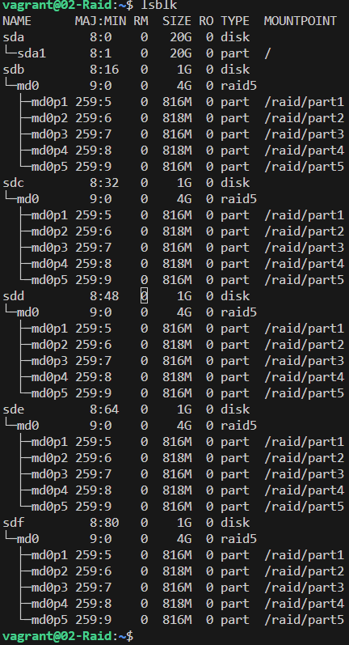
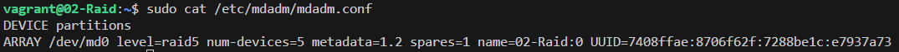
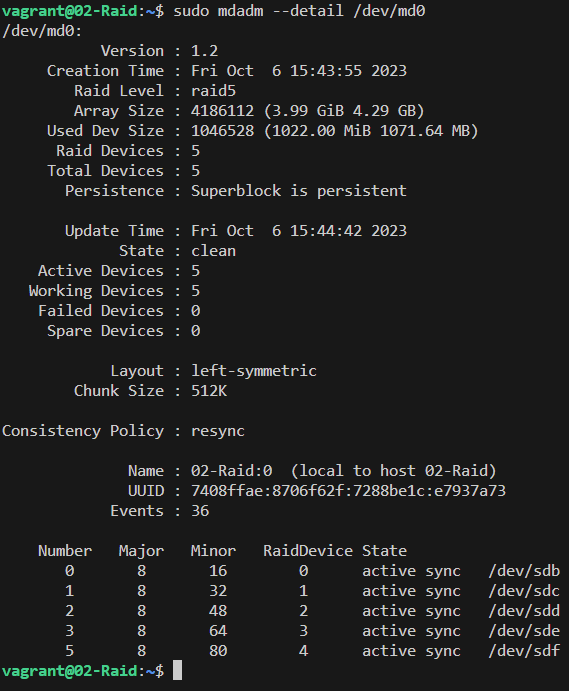

# `Дискова підсистема`

Навички роботи з mdadm

## `Завдання`

1. Додати у Vagrantfile додаткові диски
2. Зібрати R0/R5/R10 на вибір
3. Прописати зібраний рейд в конфігураційний файл, щоб рейд збирався при завантаженні
4. Створити GPT розділ та 5 partition
5. Зламати/відновити raid

### `Додаткові завдання`

1. Vagrantfile, який одразу збирає систему з підключенним рейдом та змонтованими розділами. Після перезавантаження стенду розділи мають автоматично примонтовуватись
2. Перенести працюючу систему з одним диском на RAID 1. Downtime на завантаження з нового диску передбачається

### `Вирішення`

Використовується `box` Debian 11 з оновленим ядром `linux-image-6.1.0-0.deb11.7` та `Virtualbox` `7.0.8`

В конфігурацію Vagrantfile додані додаткові диски та прописаний шлях до скрипта який виконує сбір рейд-масиву при створенні віртуальної машини
Необохідно розмістити raid.sh в одній директорії з Vagrantfile після чого можна виконати `vagrant up`

Результат виводу команди `lsblk` після завершення налаштування



Вміст файсу mdadm.conf



Детальна інформація про створений рейд



## Корисні команди

Виведення інформації про блочні пристрої

```bash
lsblk -o NAME,SIZE,FSTYPE,TYPE,MOUNTPOINT
```

Виведення інформації про рейд

```bash
mdadm --detail /dev/md0
```

```bash
cat /proc/mdstat
```

Детальна інформація про диски

```bash
lshw -c disk
```

Перевірка цілісності RAID масиву

```bash
echo 'check' >/sys/block/md0/md/sync_action
```

За ходом перевірки можна спостерігати за допомогою 

```bash
watch cat /proc/mdstat
```

## Корисні посилання

<https://gist.github.com/leifg/4713995?permalink_comment_id=1277833>

<https://rtfm.co.ua/ru/vagrant-dobavit-vtoroy-disk/>

<https://everythingshouldbevirtual.com/virtualization/vagrant-adding-a-second-hard-drive/>

<https://gist.github.com/drmalex07/e9f543766eea14ececc6a8c668921871>

<https://stackoverflow.com/questions/58141200/disk-file-creation-error-with-vbox-and-vagrant>

<https://superuser.com/questions/709055/ide-controller-on-virtualbox>

<https://stackoverflow.com/questions/52264706/storage-attach-id-different-from-the-vagrant-customisation-id>

<https://blog.open-e.com/how-does-raid-5-work/>

<https://github.com/erlong15/otus-linux>

<https://raid.wiki.kernel.org/index.php/A_guide_to_mdadm>

<https://www.linuxquestions.org/questions/linux-server-73/desperately-trying-to-setup-a-new-raid5-4175628173/>

## Підсумки

З віртуалкою на базі Debian була проблема з підключенням диска, потрібно було в `'--storagectl', 'SATA Controller',` Змінити назву контролера з `SATA` на `SATA Controller`. Назву контролера який використовує `ВМ` можнжа подивитсь після її створення (навіть невдалого) у `Virtualbox`, в налаштуваннях дисків. Іноді потрібно вказувати `IDE` або `IDE Controller`, цей параметр схоже можна контролювати на етапі створення `box`a  або це може залежати від операційної системи.
Також виникла проблема з `'--port', 1, '--device', 0,` яка вирішилась підбиранням значень `0` або `1` (в помилці була підказка)
